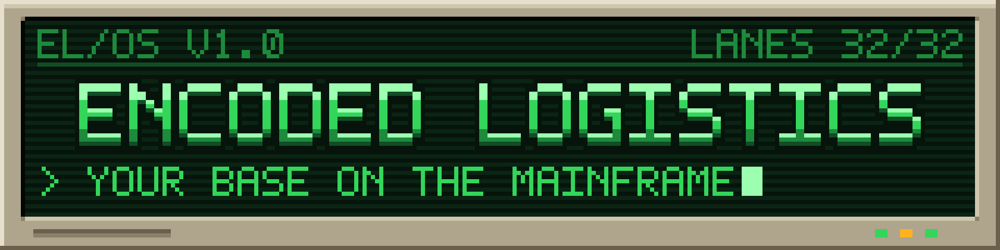

  

  Your base on the mainframe: storage networks and automation with server racks, servers and a scriptable terminal
  operating system. For Minecraft 26.3 on NeoForge.

## About

Encoded Logistics builds your base's storage into a network you run like a mainframe. Cables carry lanes from a
Network Controller to drives, terminals, ports and server racks; autocrafting runs as jobs; and a green-screen Terminal
Desk gives you a whole operating system, with its own command language (ELCL) for programs, scheduled jobs and
triggers.

## Features

- **Networks and storage:** Network Controllers, cables with lanes, and Storage Drives for items, fluids, gases and
  energy, with hot disk and cold tape storage.
- **Terminals:** Access, Fabrication and Handheld Terminals, with search, JEI support and fluid, gas and energy tabs.
- **Autocrafting:** Schematic Encoders, Fabricators, Gateways and Schedulers, including recipes with fluids and gases.
- **Server Racks:** Firewalls, Routers, UPSes, switches, servers, NAS / SAN and Tape Libraries in one multiblock.
- **Wireless:** Access Points, Wireless Bridges and Wireless Ports.
- **The Terminal OS and ELCL:** a green-screen OS on the Terminal Desk, and a command language with an editor,
  compiler, batch jobs, schedules, triggers and database files.
- **The Midrange line:** Midrange Systems with Keypunches, Card Readers, Line Printers, diskettes and printouts.
- **Automation and signals:** the Control Interface, the PLC, Display Panels, Cage Lights, Alarm Strobes and Speakers.

The full list is in [CHANGELOG.md](CHANGELOG.md).

## Requirements

- Minecraft 26.3
- NeoForge 26.3.0.0-beta or later

Optional: [JEI](https://modrinth.com/mod/jei), [Jade](https://modrinth.com/mod/jade) and
[Arcforge](https://github.com/zagdrath/arcforge) 2.5.0 or later, whose machines join a network through the Small
Wireless Bridge.

## Documentation

- [Terminal OS and ELCL guide](docs/terminal-os-elcl.html)
- [ELCL reference](docs/elcl)
- [Releasing](docs/RELEASING.md)

## License

[MIT](LICENSE)
